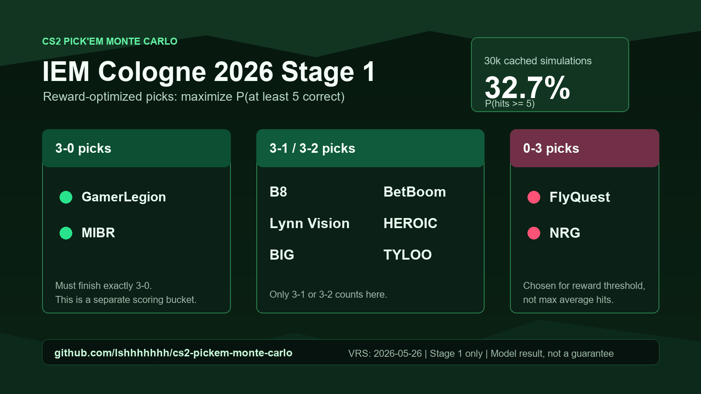

# CS2 Pick'Em Monte Carlo

Monte Carlo optimizer for CS2 Pick'Em Swiss stages.

Current scope: this repository currently implements **Stage 1 only** for IEM
Cologne Major 2026. It does not yet model Stage 2, Stage 3, or Playoffs picks.

## Current Stage 1 Result



Reward target: maximize the chance of getting at least 5 correct Stage 1 picks.

| Pick category | Teams |
| --- | --- |
| `3-0` | GamerLegion, MIBR |
| `3-1 / 3-2` | B8, BetBoom, Lynn Vision, HEROIC, BIG, TYLOO |
| `0-3` | FlyQuest, NRG |

Model estimate: `P(hits >= 5) = 32.7%` with the 2026-05-26 VRS update and
30,000 stored simulations. Full
report: [`reports/iem_cologne_2026_stage1_report.md`](reports/iem_cologne_2026_stage1_report.md).

The main objective is the in-game reward threshold, for example "get five
correct Pick'Em predictions", not simply the highest average number of correct
picks.

## Quick Start

```powershell
python .\iem_cologne_pickem_mc.py --sims 10000 --exhaustive --report reports\iem_cologne_2026_stage1_report.md
```

The default event is IEM Cologne Major 2026 Stage 1, using:

- `data/iem_cologne_2026_stage1.json`
- `data/vrs_2026-05-26.csv`

## Updating VRS

Manual CSV workflow:

1. Copy the latest VRS values into a CSV with columns `team,vrs_rank,points`.
2. Run the optimizer with `--vrs-csv`:

```powershell
python .\iem_cologne_pickem_mc.py --vrs-csv data\vrs_new.csv --sims 10000
```

HLTV page workflow:

```powershell
python .\iem_cologne_pickem_mc.py --vrs-url "https://www.hltv.org/valve-ranking/teams/2026/may/22?teamId=7020" --write-vrs-csv data\vrs_2026-05-22_from_hltv.csv --sims 10000
```

If HLTV blocks direct Python requests, save the ranking page HTML from a
browser and import it offline:

```powershell
python .\iem_cologne_pickem_mc.py --vrs-html downloads\hltv_vrs.html --write-vrs-csv data\vrs_from_saved_page.csv --sims 10000
```

The fetched CSV is saved first so the data used by the simulation is auditable.

## Reusing For Future Events

Create a new event JSON with:

- `event_name`
- `teams`: seed and team name
- `opening_matches`: round 1 pairings
- optional metadata under `format` and `sources`

Then run:

```powershell
python .\iem_cologne_pickem_mc.py --event data\future_event.json --vrs-csv data\future_vrs.csv
```

## Backtests

Austin Major 2025 Stage 1 uses the same Major Swiss Pick'Em reward shape:

```powershell
python .\iem_cologne_pickem_mc.py --event data\austin_2025_stage1.json --vrs-csv data\vrs_2025-06-02_austin_stage1.csv --load-sims runs\austin_2025_stage1_vrs_2025-06-02_seed20260522_30000.jsonl --report reports\austin_2025_stage1_backtest_report.md
python .\scripts\score_pickem.py --event data\austin_2025_stage1.json --three-oh HEROIC FlyQuest --advance Complexity TYLOO B8 "Lynn Vision" NRG BetBoom --zero-three Fluxo Metizport
```

IEM Cologne 2025 Stage 1 used a different Play-In bracket, so it has a separate
bracket backtest instead of a `3-0` / `Advance` / `0-3` Pick'Em optimizer:

```powershell
python .\scripts\backtest_iem_cologne_2025_playin.py
```

Current sanity checks:

- Austin Major 2025 Stage 1: `6 / 10` Pick'Em hits using the 2025-06-02 VRS snapshot.
- IEM Cologne 2025 Stage 1 / Play-In: `6 / 8` Stage 2 advancers hit using the 2025-07-07 VRS snapshot.

## Model Assumptions

- 16-team Swiss stage.
- Teams advance at 3 wins and are eliminated at 3 losses.
- Pick'Em scoring treats `3-0`, `3-1 / 3-2`, and `0-3` as separate buckets.
- Round 1 and non-decider matches are Bo1.
- Advancement and elimination matches are Bo3.
- Later Swiss rounds are paired inside score groups by Buchholz score, avoiding rematches where possible.
- VRS point difference is translated into map win probability with a logistic curve.

Useful options:

- `--scale`: lower values make VRS gaps more decisive. Default: `400`.
- `--threshold`: reward threshold. Default: `5`.
- `--candidate-pool`: search breadth for reward optimization. Default: `10`.
- `--exhaustive`: evaluate every legal Pick'Em combination. For Stage 1 this
  checks `10,090,080` combinations.
- `--seed`: random seed for reproducibility.
- `--report`: write a markdown report.

## Simulation Count

For IEM Cologne Major 2026 Stage 1, the current result uses 30,000 stored
simulations with the 2026-05-26 VRS snapshot. Exhaustive reward optimization is
available over all `10,090,080` legal Pick'Em combinations via `--exhaustive`;
the candidate-pruned search is much faster. A 10,000-simulation exhaustive
check matched the same strategic shape after fixing the separate `3-1 / 3-2`
scoring bucket.

This is evidence of practical stability for the model, not a formal guarantee.
Model assumptions and VRS freshness matter more than the remaining Monte Carlo
sampling error.
